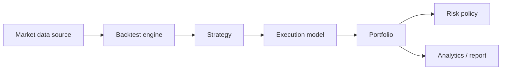

# Architecture

The engine owns sequencing only. Strategies receive immutable bars and submit intent through an `OrderSink`; they do not mutate positions. The execution model owns fill price, capacity, latency, and costs. The portfolio is the sole owner of accounting state. This separation prevents future live adapters from inheriting backtest-only assumptions.

`MarketDataSource`, `Strategy`, `ExecutionModel`, and `RiskPolicy` are structural interfaces. Constructors receive their collaborators, keeping test fixtures compact and avoiding global state.
